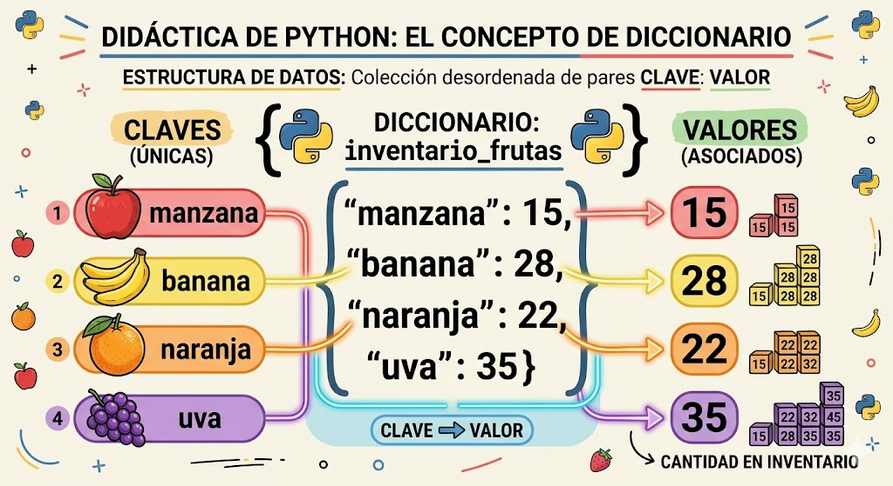

# diccionarios_python
conceptos y ejercicios de diccionarios en python

°

°son una coleccion desordenada de pares de la forma **claves:valor**, conocidos como elementos o ites

°Son mutables, una vez definido se le pueden agregar nuevos elementos, modificar o eliminar algunos de los que ya tiene.

Tambien son conocidos como arreglos asociativos.

## Representación gráfica den un diccionario



## sintaxis


`nombre_diccionario = {clavel: valori, clave2:valor2...}`

-cada item o elemnto tiene la forma **clave: valor**

-en cada item hay una clave y uno o mas valores. si se desconoce el valor se puede completar con
*none*
-los elemtos del diccionario se indexan por clave
-las claves solo pueden ser datos imutables
-los claves no pueden repetirse dentro un diccionario

### Ejemplo

`frutas = {'manzan': 34, 'pera':45}`

## Operaciones

### Agregar elemtos


`nombre diccionario [clave] =`

`frutas['cereza'] = 90`

### Consultar o modificar elementos
```PY
print(`El valor de pera es: `, frutas [`pera`])

### Eliminar elementos

del frutas['pera']`

### Operador de pertenencia


if 'cereza' in frutas:

    print('si esta cereza en el diccionario')
else:
    print('no esta cereza en el diccionario')

## Ejercicio
Cree un programa en Python que utilice un diccionario para guardar los nombres de sus amigos y su telefono.  En este caso, el diccionario representa una agenda telefónica.  El programa pedirá nombres y telefonos y los irá guardando en el diccionario (los nombres en mayúscula).  Además, el programa debe permitir consultar o eliminar un telefono.  Incluya un menú de opciones.
